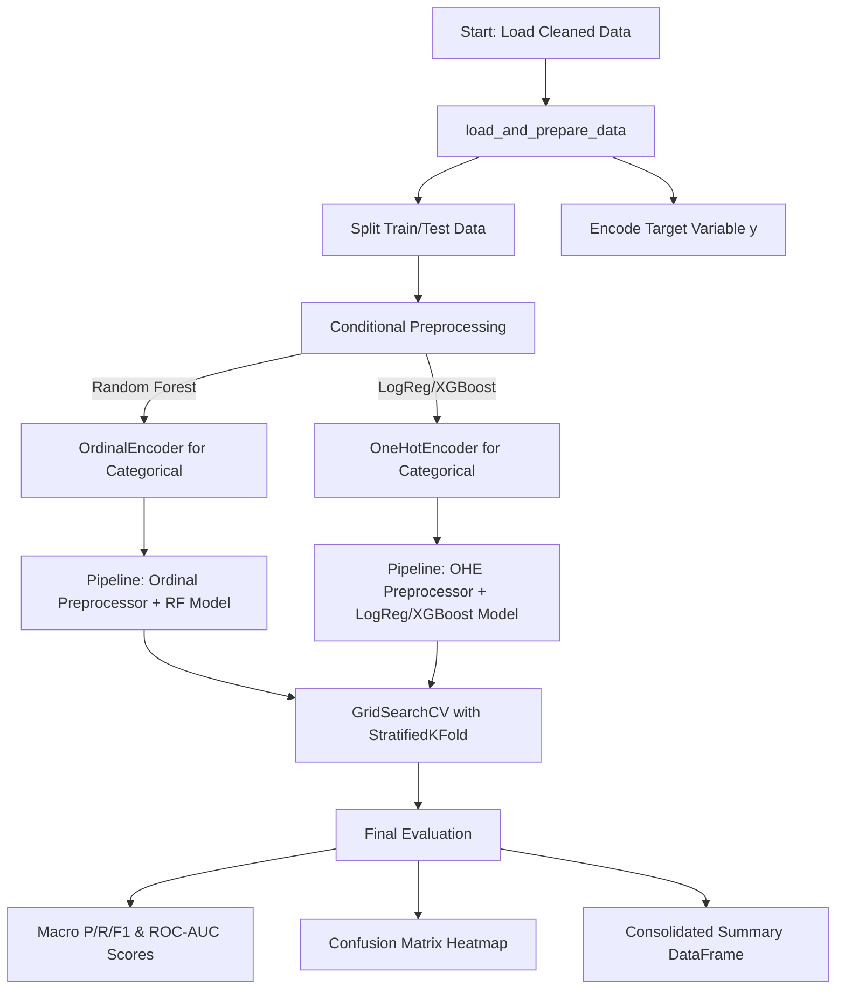
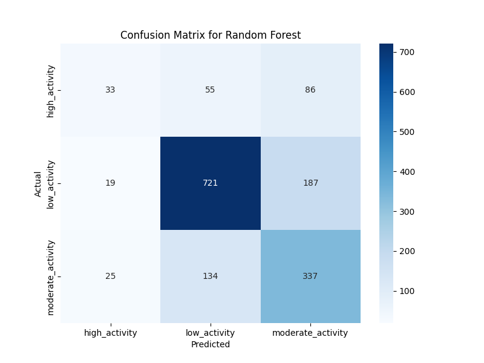

# AIAP End-to-End Activity-Level ML Pipeline

---

## Repository Structure

```
aiap-ongchunming-613A/
├── .github/
├── README.md                 # This overview and usage guide
├── data/                     # Data directory (not committed)
│   └── gas_monitoring.db     # Raw SQLite database
├── src/                      # Source code for the ML pipeline
│   └── mlp.py                # Main Python script for the entire pipeline
├── eda.ipynb                 # Jupyter notebook for Exploratory Data Analysis
├── requirements.txt          # Pinned Python dependencies
└── run.sh                    # Example execution script
```

---

## Quick Start & Configuration

1.  **Clone the Repository**
    ```bash
    git clone https://github.com/cmong007/aiap21-ongchunming-613A.git
    ```
2.  **Create and Activate a Virtual Environment**
    ```bash
    # Windows
    python -m venv venv
    venv\Scripts\activate
    ```
3.  **Install Dependencies**
    ```bash
    pip install -r requirements.txt
    ```
    *Note: This includes `pandas`, `scikit-learn`, `xgboost`, `seaborn`, and `matplotlib`.*

4.  **Run the Pipeline**
    ```bash
    python src/mlp.py
    ```
    The script will automatically:
    - Load and prepare data from `data/gas_monitoring_cleaned.csv`.
    - Train, tune, and evaluate three different classification models.
    - Print detailed performance reports and confusion matrices for each model.
    - Display a final, consolidated summary table comparing all models.

---

## Logical Flow of the Pipeline

The pipeline is designed to be modular and reusable, with distinct functions for each logical step.



---

## Key EDA Insights & Pipeline Actions

The modeling choices were directly informed by the Exploratory Data Analysis (`eda.ipynb`).

| Insight from EDA | Pipeline Action |
| :--- | :--- |
| `MetalOxideSensor_Unit1` and `Unit4` are highly correlated. | Combined into a single feature (`MetalOxideSensor_Unit1&4_avg`) to reduce redundancy. |
| `Activity Level` is significantly imbalanced, with "Low Activity" dominating. | Handled by using `class_weight='balanced'` in Logistic Regression and Random Forest. |
| `HVAC Operation Mode` and `Ambient Light Level` show no significant relationship with the target. | Dropped from the feature set to reduce noise and simplify the model. |
| Tree-based models (Random Forest) and linear models (Logistic Regression) have different preprocessing needs. | Implemented a conditional pipeline that applies **Ordinal Encoding** for Random Forest and **One-Hot Encoding** for all other models. |

---

## Feature Processing Summary

| Feature Group | Features | Transformation | Justification |
| :--- | :--- | :--- | :--- |
| **Numeric** | Temperature, Humidity, CO2 Sensors, MOS Sensors | `StandardScaler` | Standardizes features to have zero mean and unit variance, essential for linear models and SVMs. |
| **Categorical** | Time of Day, CO_GasSensor | **Conditional:** `OneHotEncoder` or `OrdinalEncoder` | **OHE** for linear models/XGBoost to prevent false ordinal relationships. **Ordinal** for Random Forest as it's more efficient and handles categories naturally. |
| **Target** | Activity Level | `LabelEncoder` | Converts string labels to integers (0, 1, 2...), which is a requirement for the XGBoost classifier. |

---

## Model Choices & Justification

Three models were selected to compare different algorithmic approaches. Hyperparameter tuning is performed on all models using `GridSearchCV`.

| Model | Purpose & Justification | Key Tuned Hyperparameters |
| :--- | :--- | :--- |
| **Logistic Regression** | Provides a strong, interpretable baseline. Excellent for understanding linear relationships in the data. | `C` (Inverse of regularization strength) |
| **Random Forest** | A robust, non-linear model that captures complex interactions between features and is less prone to overfitting than a single decision tree. | `n_estimators`, `max_depth` |
| **XGBoost** | A state-of-the-art gradient boosting algorithm known for its high performance, speed, and efficiency. | `n_estimators`, `learning_rate`, `max_depth` |

---

## Evaluation Metrics & Explanation

Given the class imbalance, accuracy alone is misleading. The pipeline focuses on the following robust metrics:

-   **Macro-Averaged Precision, Recall, F1-Score**: These metrics treat each class equally, ensuring the model's performance on the minority "High Activity" and "Moderate Activity" classes is properly represented.
-   **ROC-AUC (One-vs-Rest)**: Measures the model's ability to distinguish between classes, independent of the classification threshold. It provides a good overall measure of predictive power.
-   **Confusion Matrix**: A visual heatmap showing exactly where the model is making correct and incorrect predictions for each class.
-   **Train vs. Test Comparison**: All key metrics are calculated for both the training and test sets to diagnose potential overfitting.

---

## Final Model Comparison & Selection

To select the best model, we must analyze not only the overall macro-averages but also the per-class performance, especially given the class imbalance.

### Performance Reports (Test Set)

The detailed performance for each tuned model on the test set is as follows:

**Logistic Regression:**
| Class             | Precision | Recall | F1-Score |
| :---------------- | :-------- | :----- | :------- |
| high_activity     | 0.21      | 0.55   | 0.30     |
| low_activity      | 0.81      | 0.68   | 0.74     |
| moderate_activity | 0.57      | 0.41   | 0.48     |

**Random Forest:**
| Class             | Precision | Recall | F1-Score |
| :---------------- | :-------- | :----- | :------- |
| high_activity     | 0.47      | 0.18   | 0.26     |
| low_activity      | 0.80      | 0.79   | 0.79     |
| moderate_activity | 0.56      | 0.70   | 0.62     |

**XGBoost:**
| Class             | Precision | Recall | F1-Score |
| :---------------- | :-------- | :----- | :------- |
| high_activity     | 0.20      | 0.01   | 0.01     |
| low_activity      | 0.78      | 0.77   | 0.77     |
| moderate_activity | 0.52      | 0.71   | 0.60     |

### Model Selection Justification
| Model                   | Test Macro Precision | Test Macro Recall | Test Macro F1-Score | Test ROC-AUC |
| :---------------------- | :------------------- | :---------------- | :------------------ | :----------- |
| **Random Forest**       | 0.5672               | 0.5403            | 0.5484              | 0.7993       |
| **XGBoost**             | 0.5989               | 0.4701            | 0.5011              | 0.7960       |
| **Logistic Regression** | 0.5291               | 0.4896            | 0.5044              | 0.7437       |





**Comparison**

While **Logistic Regression** achieved a much higher **Recall (0.55)** for the `high_activity` class, it came at the cost of a very low **Precision (0.21)**. This means that while it was "sensitive" and caught more high-activity events, it also created a large number of false alarms; when it predicted "High Activity," it was wrong nearly 80% of the time.

The **Random Forest** model, conversely, provided a much better balance. Although its recall for `high_activity` was lower (0.18), its precision was more than twice as high (0.47). This means its predictions, when made, were far more reliable.

The **Macro F1-Score** is the deciding factor because it finds the optimal balance between precision and recall across *all* classes. The Random Forest's superior Macro F1-Score (0.56 vs. 0.51) and its higher overall ROC-AUC score confirm that it is the most balanced and reliable model for this specific business problem.


While the Random Forest model was the top performer, a deeper look at the per-class metrics and confusion matrix reveals critical insights into its behavior.

 1. **Strong Performance on Majority/Moderate Classes:** The model is very effective at identifying `low_activity`and `moderate_activity`. The high precision for `low_activity` means its predictions for this class are reliable.

 2.  **Weakness in Minority Class:** The primary weakness is the very poor **Recall of 0.18** for `high_activity`. The model fails to detect the vast majority of high-activity events, misclassifying them most often as `moderate_activity` (as seen in the confusion matrix).


**Recommendations for Improvement:**
│
1.  **Address Overfitting:** Maybe less depth could be specfied during hyperparameter tuning. Regularization could also be explored.
2.  **Improve Minority Class Detection:** The `class_weight` parameter was helpful but not sufficient. SMOTE could be used to generate more `high_activity` samples or exploring different algorithms entirely (like anomaly detection models) to identify these rare events.
3.  **Feature Engineering:** Create features that specifically target the transition into a high-activity state, which might provide a stronger signal for the model to learn.


---
